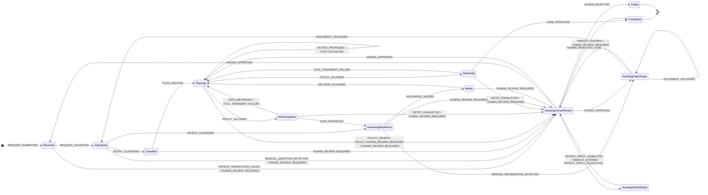

# תוצאות Alloy - מכונת המצבים של סעיף 3

<!-- GENERATED by scripts/alloy_check.py - do not edit by hand -->

- **מתי:** 2026-10-02 17:16
- **כלי:** Alloy 6.2.0, solver `sat4j`
- **מודל:** `fsm_model.als`, נוצר אוטומטית מ־`backend/hospital_agent/fsm.py` (41 שורות סעיף 3 + 3 שורות הרחבה, 13 מצבים, 14 סוגי הסלמה); `fsm_plan.als` מוסיף את מיקום התוכנית ואת השערים שקוראים אותו, כפי שהם כתובים ב־`guards.py`
- **14 תכונות מתקיימות, באג אחד שנמצא ותוקן, 16 חיפושי מסלול, 1353 שניות.** כל התוצאות כצפוי.

**איך לקרוא:** `check` - Alloy מחפש דוגמה נגדית בכל מסלול עד 20 צעדים; "מתקיים" = אין אף מסלול שמפר את התכונה. `run` - Alloy מחפש מסלול אחד; "נמצא" = בר־השגה.

## 1. התכונות שמתקיימות

A ו־B נבדקות על הטבלה בלבד, לכל תוצאה של השערים. P2 ו־P3 נבדקות מול השערים שקוראים את מיקום התוכנית, כי על הטבלה לבדה יש להן דוגמה נגדית - הן מחזיקות בזכות השערים.

| # | תכונה | היקף | תוצאה | כצפוי |
|---|---|---|---|---|
| `A1_NoDeadEnd` | לכל מצב שאינו סופי יש יציאה - פנייה אינה נתקעת | `1 but 1 steps` | ✅ מתקיים | ✓ |
| `A2_TerminalHasNoExit` | אין שום מעבר שיוצא ממצב סופי | `1 but 1 steps` | ✅ מתקיים | ✓ |
| `A3_MedicalQuestionGoesToHuman` | T5: שאלה רפואית עוברת תמיד לאדם | `1 but 1 steps` | ✅ מתקיים | ✓ |
| `A4_EveryEscalationNamesItsKind` | כל כניסה לבקרה אנושית נושאת סיבה (escalation_kind) | `1 but 1 steps` | ✅ מתקיים | ✓ |
| `A5_ApprovalNeedsAKind` | אישור צוות שמחזיר לאוטומציה דורש סוג הסלמה מסוים | `1 but 1 steps` | ✅ מתקיים | ✓ |
| `B1_T11_TerminalIsFinal` | T11: ממצב סופי עוברים רק לאותו מצב סופי | `1 but 1..20 steps` | ✅ מתקיים | ✓ |
| `B2_ReviewAlwaysCarriesAKind` | פנייה בבקרה אנושית תמיד נושאת את סיבתה | `1 but 1..20 steps` | ✅ מתקיים | ✓ |
| `B3_LeaveReviewOnlyByStaff` | רק החלטת צוות מוציאה פנייה מבקרה אנושית | `1 but 1..20 steps` | ✅ מתקיים | ✓ |
| `B4_NoAutomationAfterMedicalDeniedOrUnsafe` | שאלה רפואית, דחיית מדיניות או הסלמת בטיחות אינן חוזרות לאוטומציה | `1 but 1..20 steps` | ✅ מתקיים | ✓ |
| `B5_ValidatedBeforeClassification` | אין סיווג לפני בקשה מאומתת | `1 but 1..20 steps` | ✅ מתקיים | ✓ |
| `B6_CallsOnlyAfterPolicyAllowed` | T1: קריאה חיצונית מתחילה רק מאישור מדיניות | `1 but 1..20 steps` | ✅ מתקיים | ✓ |
| `B7_T8_ReadyOnlyThroughReadiness` | T8: Ready רק דרך בדיקת מוכנות שעברה | `1 but 1..20 steps` | ✅ מתקיים | ✓ |
| `P2_NoDeliveryBeforeReady_CanAdvanceNow` | אין שליחה למטופל לפני Ready (T8) | `1 but 1..20 steps` | ✅ מתקיים | ✓ |
| `P3_PlanBeforePlanning_WithPlanGuards` | אין תכנון בלי תוכנית שלמה (Unsupported לא מגיעה לשם) | `1 but 1..20 steps` | ✅ מתקיים | ✓ |

## 2. הבאג ש־Alloy מצא - לפני ואחרי התיקון

`CanAdvance` (§3.1: "המצביע החדש נמצא בתוך התוכנית") בדק רק שיש צעד הבא. לכן ה־State Manager אישר `PLAN_CREATED` ואחריו שלושה `STEP_ADVANCED` אל צעד המסירה, ו־`POLICY_ALLOWED` העביר את הפנייה ל־`Delivering` - קריאה לערוץ המטופל בלי שליפת נתונים ובלי בדיקת מוכנות. רק סדר הפעולות של ה־Orchestrator מנע זאת בפועל, והטסטים לא תפסו את זה כי הם מריצים את הקוד במסלולים שהוא באמת עובר - Alloy בודק כל מסלול שה־FSM מרשה. הבאג שוחזר מול ה־State Manager האמיתי ותוקן: ב־`STEP_ADVANCED` התוכנית מתקדמת רק בתוך שלב השליפה, וצעד המסירה מושג רק ב־`DELIVERY_PLANNED` מ־Ready (`spec_corrections` תיקון 99).

| | `CanAdvance` | תוצאה | כצפוי |
|---|---|---|---|
| **לפני** (`P1_NoDeliveryBeforeReady_OldCanAdvance`) | "יש צעד הבא" | ⚠️ דוגמה נגדית | ✓ |
| **אחרי** (`P2_NoDeliveryBeforeReady_CanAdvanceNow`) | בתוך שלב השליפה בלבד | ✅ מתקיים | ✓ |

### המסלול שמצא את הבאג (לפני התיקון)

`↺` = המקום שאליו המסלול חוזר אחרי הצעד האחרון: Alloy 6 מייצג כל מסלול כאינסופי, כלולאה.

| צעד | מצב · צעד בתוכנית | escalation_kind | השורה שהביאה לכאן |
|---|---|---|---|
| 0 | Initial | - | - |
| 1 | Received | - | R01 REQUEST_SUBMITTED |
| 2 | Classifying | - | R02 REQUEST_VALIDATED |
| 3 | Classified | - | R04 INTENT_CLASSIFIED |
| 4 | Planning · S1 CheckAppointment | - | R08 PLAN_CREATED |
| 5 | Planning · S2 CheckDocuments | - | R11 STEP_ADVANCED |
| 6 | Planning · S3 LoadInstructions | - | R11 STEP_ADVANCED |
| 7 | Planning · S4 SendStatusUpdate | - | R11 STEP_ADVANCED |
| 8 ↺ | Delivering · S4 SendStatusUpdate | - | R13 POLICY_ALLOWED |
| 9 | Planning · S4 SendStatusUpdate | - | R23 TOOL_TRANSIENT_FAILURE |

## 3. הגעה למצבים ותרחישים

כל 13 המצבים ברי־השגה, ושלושת התרחישים עוברים תחת השערים כפי שהם בקוד - כלומר התכונות בסעיף 1 אינן מתקיימות רק משום שהשערים חוסמים הכול.

| # | מה | היקף | תוצאה | כצפוי |
|---|---|---|---|---|
| `D_reach_Received` | הגעה למצב Received | `1 but 1..20 steps` | ✅ נמצא | ✓ |
| `D_reach_Classifying` | הגעה למצב Classifying | `1 but 1..20 steps` | ✅ נמצא | ✓ |
| `D_reach_Classified` | הגעה למצב Classified | `1 but 1..20 steps` | ✅ נמצא | ✓ |
| `D_reach_Planning` | הגעה למצב Planning | `1 but 1..20 steps` | ✅ נמצא | ✓ |
| `D_reach_RetrievingData` | הגעה למצב RetrievingData | `1 but 1..20 steps` | ✅ נמצא | ✓ |
| `D_reach_Delivering` | הגעה למצב Delivering | `1 but 1..20 steps` | ✅ נמצא | ✓ |
| `D_reach_AssessingReadiness` | הגעה למצב AssessingReadiness | `1 but 1..20 steps` | ✅ נמצא | ✓ |
| `D_reach_AwaitingPatientInput` | הגעה למצב AwaitingPatientInput | `1 but 1..20 steps` | ✅ נמצא | ✓ |
| `D_reach_AwaitingHumanReview` | הגעה למצב AwaitingHumanReview | `1 but 1..20 steps` | ✅ נמצא | ✓ |
| `D_reach_Ready` | הגעה למצב Ready | `1 but 1..20 steps` | ✅ נמצא | ✓ |
| `D_reach_Completed` | הגעה למצב Completed | `1 but 1..20 steps` | ✅ נמצא | ✓ |
| `D_reach_Failed` | הגעה למצב Failed | `1 but 1..20 steps` | ✅ נמצא | ✓ |
| `D_reach_AwaitingPatientReply` | הגעה למצב AwaitingPatientReply | `1 but 1..20 steps` | ✅ נמצא | ✓ |
| `E1_AutomaticCompletion` | תרחיש 1: השלמה אוטומטית דרך מוכנות | `1 but 1..20 steps` | ✅ נמצא | ✓ |
| `E2_MedicalQuestionClosedByStaff` | תרחיש 2: שאלה רפואית נסגרת על ידי צוות | `1 but 1..20 steps` | ✅ נמצא | ✓ |
| `E3_MissingDocumentThenReclassified` | מסמך חסר, המטופל מעלה, הפנייה מסווגת מחדש (T10) | `1 but 1..20 steps` | ✅ נמצא | ✓ |

### מסלול: `E1_AutomaticCompletion`

תרחיש 1: השלמה אוטומטית דרך מוכנות

`↺` = המקום שאליו המסלול חוזר אחרי הצעד האחרון: Alloy 6 מייצג כל מסלול כאינסופי, כלולאה.

| צעד | מצב · צעד בתוכנית | escalation_kind | השורה שהביאה לכאן |
|---|---|---|---|
| 0 | Initial | - | - |
| 1 | Received | - | R01 REQUEST_SUBMITTED |
| 2 | Classifying | - | R02 REQUEST_VALIDATED |
| 3 | Classified | - | R04 INTENT_CLASSIFIED |
| 4 | Planning · S1 CheckAppointment | - | R08 PLAN_CREATED |
| 5 | Planning · S2 CheckDocuments | - | R11 STEP_ADVANCED |
| 6 | Planning · S3 LoadInstructions | - | R11 STEP_ADVANCED |
| 7 | RetrievingData · S3 LoadInstructions | - | R12 POLICY_ALLOWED |
| 8 | AssessingReadiness · S3 LoadInstructions | - | R18 DATA_RETRIEVED |
| 9 | Ready · S3 LoadInstructions | - | R26 READINESS_PASSED |
| 10 | Planning · S4 SendStatusUpdate | - | R32 DELIVERY_PLANNED |
| 11 | Delivering · S4 SendStatusUpdate | - | R13 POLICY_ALLOWED |
| 12 | Completed · S4 SendStatusUpdate | - | R22 CASE_RESOLVED |
| 13 ↺ | Completed · S4 SendStatusUpdate | - | R22 CASE_RESOLVED |

### מסלול: `E2_MedicalQuestionClosedByStaff`

תרחיש 2: שאלה רפואית נסגרת על ידי צוות

`↺` = המקום שאליו המסלול חוזר אחרי הצעד האחרון: Alloy 6 מייצג כל מסלול כאינסופי, כלולאה.

| צעד | מצב · צעד בתוכנית | escalation_kind | השורה שהביאה לכאן |
|---|---|---|---|
| 0 | Initial | - | - |
| 1 | Received | - | R01 REQUEST_SUBMITTED |
| 2 | Classifying | - | R02 REQUEST_VALIDATED |
| 3 | AwaitingHumanReview | MedicalQuestion | R06 MEDICAL_QUESTION_DETECTED |
| 4 | Completed | - | R40 HUMAN_RESOLVED_CASE |
| 5 ↺ | Completed | - | R40 HUMAN_RESOLVED_CASE |

### מסלול: `E3_MissingDocumentThenReclassified`

מסמך חסר, המטופל מעלה, הפנייה מסווגת מחדש (T10)

`↺` = המקום שאליו המסלול חוזר אחרי הצעד האחרון: Alloy 6 מייצג כל מסלול כאינסופי, כלולאה.

| צעד | מצב · צעד בתוכנית | escalation_kind | השורה שהביאה לכאן |
|---|---|---|---|
| 0 | Initial | - | - |
| 1 | Received | - | R01 REQUEST_SUBMITTED |
| 2 | Classifying | - | R02 REQUEST_VALIDATED |
| 3 | Classified | - | R04 INTENT_CLASSIFIED |
| 4 | Planning · S1 CheckAppointment | - | R08 PLAN_CREATED |
| 5 | Planning · S2 CheckDocuments | - | R11 STEP_ADVANCED |
| 6 | Planning · S3 LoadInstructions | - | R11 STEP_ADVANCED |
| 7 | RetrievingData · S3 LoadInstructions | - | R12 POLICY_ALLOWED |
| 8 | AssessingReadiness · S3 LoadInstructions | - | R18 DATA_RETRIEVED |
| 9 ↺ | AwaitingPatientInput · S3 LoadInstructions | - | R27 MISSING_INFORMATION_DETECTED |
| 10 | Classifying · S3 LoadInstructions | - | R29 DOCUMENT_UPLOADED |
| 11 | AssessingReadiness · S3 LoadInstructions | - | R05 INTENT_CLASSIFIED |

## 4. תרשים המצבים (מתוך המודל)

