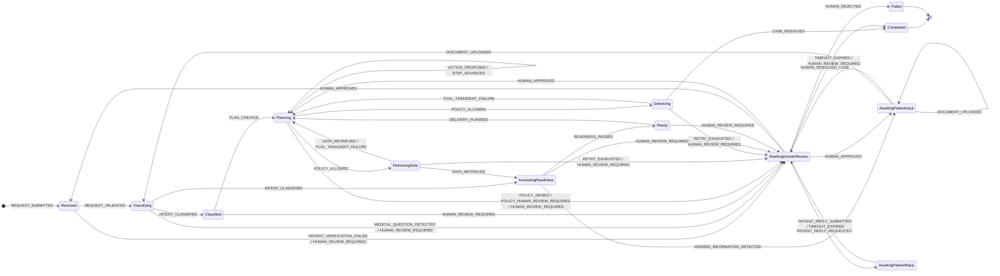

# תוצאות Alloy - מכונת המצבים של סעיף 3

<!-- GENERATED by scripts/alloy_check.py - do not edit by hand -->

- **מתי:** 2026-10-02 00:19
- **כלי:** Alloy 6.2.0, solver `sat4j`
- **מודל:** `fsm_model.als`, נוצר אוטומטית מ־`backend/hospital_agent/fsm.py` (41 שורות סעיף 3 + 3 שורות הרחבה, 13 מצבים, 14 סוגי הסלמה)
- **תכונות:** `fsm_checks.als`
- **16 בדיקות, 16 חיפושי מסלול, 544 שניות סה"כ.** כל התוצאות כצפוי.

**איך לקרוא:** `check` - Alloy מחפש דוגמה נגדית בכל מסלול עד גבול הצעדים; "מתקיים" = אין אף מסלול שמפר את התכונה, לכל תוצאה של השערים (השערים אינם ממודלים). `run` - Alloy מחפש מסלול אחד; "נמצא" = המצב או התרחיש בר־השגה.

## בדיקות (check)

| # | תכונה | היקף | תוצאה | כצפוי |
|---|---|---|---|---|
| `A1_NoDeadEnd` | לכל מצב שאינו סופי יש יציאה - פנייה אינה נתקעת | `1 but 1 steps` | ✅ מתקיים | ✓ |
| `A2_TerminalHasNoExit` | אין שום מעבר שיוצא ממצב סופי | `1 but 1 steps` | ✅ מתקיים | ✓ |
| `A3_MedicalQuestionGoesToHuman` | T5: שאלה רפואית עוברת תמיד לאדם | `1 but 1 steps` | ✅ מתקיים | ✓ |
| `A4_EveryEscalationNamesItsKind` | כל כניסה לבקרה אנושית נושאת סיבה (escalation_kind) | `1 but 1 steps` | ✅ מתקיים | ✓ |
| `A5_ApprovalNeedsAKind` | אישור צוות שמחזיר לאוטומציה דורש סוג הסלמה מסוים | `1 but 1 steps` | ✅ מתקיים | ✓ |
| `B1_T11_TerminalIsFinal` | T11: ממצב סופי עוברים רק לאותו מצב סופי | `1 but 1..20 steps` | ✅ מתקיים | ✓ |
| `B2_ReviewAlwaysCarriesAKind` | פנייה בבקרה אנושית תמיד נושאת את סיבתה | `1 but 1..20 steps` | ✅ מתקיים | ✓ |
| `B3_LeaveReviewOnlyByStaff` | רק החלטת צוות מוציאה פנייה מבקרה אנושית | `1 but 1..20 steps` | ✅ מתקיים | ✓ |
| `B4_NoAutomationAfterMedicalDeniedOrUnsafe` | שאלה רפואית, דחיית מדיניות או הסלמת בטיחות אינן חוזרות לאוטומציה | `1 but 1..20 steps` | ✅ מתקיים | ✓ |
| `B5_ValidatedBeforeClassification` | אין סיווג לפני בקשה מאומתת | `1 but 1..20 steps` | ✅ מתקיים | ✓ |
| `B7_CallsOnlyAfterPolicyAllowed` | T1: קריאה חיצונית מתחילה רק מאישור מדיניות | `1 but 1..20 steps` | ✅ מתקיים | ✓ |
| `B8_T8_ReadyOnlyThroughReadiness` | T8: Ready רק דרך בדיקת מוכנות שעברה | `1 but 1..20 steps` | ✅ מתקיים | ✓ |
| `C1_AutoCompletionNeedsReady_GuardsAbstracted` | השלמה אוטומטית עוברת דרך Ready - בלי השער delivery_action | `1 but 1..20 steps` | ⚠️ דוגמה נגדית | ✓ |
| `C2_AutoCompletionNeedsReady_WithDeliveryGuard` | השלמה אוטומטית עוברת דרך Ready - עם השער delivery_action | `1 but 1..20 steps` | ✅ מתקיים | ✓ |
| `C3_PlanBeforePlanning_GuardsAbstracted` | אין תכנון בלי תוכנית שלמה - בלי השער ReadinessInProgress | `1 but 1..20 steps` | ⚠️ דוגמה נגדית | ✓ |
| `C4_PlanBeforePlanning_WithReadinessGuard` | אין תכנון בלי תוכנית שלמה - עם השער ReadinessInProgress | `1 but 1..20 steps` | ✅ מתקיים | ✓ |

**C1 ו־C2 יחד:** בלי השערים, Alloy מוצא מסלול שבו פנייה מגיעה ל־Delivering ישירות מ־Planning ונסגרת בלי לעבור דרך Ready - כלומר הטבלה לבדה אינה מבטיחה זאת. C2 מוסיף את החוזה של השער `delivery_action` (צעד המסירה מושג רק דרך `DELIVERY_PLANNED`, שיוצא מ־Ready) - ואז התכונה מתקיימת. זו הוכחה שהבטיחות כאן נשענת על השער, ושהשער מספיק.

**C3 ו־C4 - ממצא ש־Alloy העלה בעצמו:** "אין תכנון בלי תוכנית שלמה" נכתב במקור כבדיקה רגילה, ו־Alloy מצא לה דוגמה נגדית: Classifying → (R05) AssessingReadiness → Ready → DELIVERY_PLANNED → Planning, בלי `PLAN_CREATED` בדרך. השורה R05 היא שורת הסיווג־מחדש, והשער שלה `ReadinessInProgress` מתקיים רק כשלפנייה כבר יש תוכנית ונתוני מוכנות - כלומר אחרי שנבנתה תוכנית. C4 מוסיף את החוזה של השער, והתכונה מתקיימת. גם כאן: הטבלה לבדה אינה מספיקה, השער כן.

## הגעה למצבים ותרחישים (run)

| # | מה | היקף | תוצאה | כצפוי |
|---|---|---|---|---|
| `D_reach_Received` | הגעה למצב Received | `1 but 1..20 steps` | ✅ נמצא | ✓ |
| `D_reach_Classifying` | הגעה למצב Classifying | `1 but 1..20 steps` | ✅ נמצא | ✓ |
| `D_reach_Classified` | הגעה למצב Classified | `1 but 1..20 steps` | ✅ נמצא | ✓ |
| `D_reach_Planning` | הגעה למצב Planning | `1 but 1..20 steps` | ✅ נמצא | ✓ |
| `D_reach_RetrievingData` | הגעה למצב RetrievingData | `1 but 1..20 steps` | ✅ נמצא | ✓ |
| `D_reach_Delivering` | הגעה למצב Delivering | `1 but 1..20 steps` | ✅ נמצא | ✓ |
| `D_reach_AssessingReadiness` | הגעה למצב AssessingReadiness | `1 but 1..20 steps` | ✅ נמצא | ✓ |
| `D_reach_AwaitingPatientInput` | הגעה למצב AwaitingPatientInput | `1 but 1..20 steps` | ✅ נמצא | ✓ |
| `D_reach_AwaitingHumanReview` | הגעה למצב AwaitingHumanReview | `1 but 1..20 steps` | ✅ נמצא | ✓ |
| `D_reach_Ready` | הגעה למצב Ready | `1 but 1..20 steps` | ✅ נמצא | ✓ |
| `D_reach_Completed` | הגעה למצב Completed | `1 but 1..20 steps` | ✅ נמצא | ✓ |
| `D_reach_Failed` | הגעה למצב Failed | `1 but 1..20 steps` | ✅ נמצא | ✓ |
| `D_reach_AwaitingPatientReply` | הגעה למצב AwaitingPatientReply | `1 but 1..20 steps` | ✅ נמצא | ✓ |
| `E1_AutomaticCompletion` | תרחיש 1: השלמה אוטומטית דרך מוכנות | `1 but 1..20 steps` | ✅ נמצא | ✓ |
| `E2_MedicalQuestionClosedByStaff` | תרחיש 2: שאלה רפואית נסגרת על ידי צוות | `1 but 1..20 steps` | ✅ נמצא | ✓ |
| `E3_MissingDocumentThenReclassified` | מסמך חסר, המטופל מעלה, הפנייה מסווגת מחדש (T10) | `1 but 1..20 steps` | ✅ נמצא | ✓ |

### מסלול: `C1_AutoCompletionNeedsReady_GuardsAbstracted`

השלמה אוטומטית עוברת דרך Ready - בלי השער delivery_action

`↺` = המקום שאליו המסלול חוזר אחרי הצעד האחרון: Alloy 6 מייצג כל מסלול כאינסופי, כלולאה.

| צעד | מצב | escalation_kind | השורה שהביאה לכאן |
|---|---|---|---|
| 0 | Initial | - | - |
| 1 | Received | - | R01 REQUEST_SUBMITTED |
| 2 | Classifying | - | R02 REQUEST_VALIDATED |
| 3 | Classified | - | R04 INTENT_CLASSIFIED |
| 4 | Planning | - | R08 PLAN_CREATED |
| 5 | Delivering | - | R13 POLICY_ALLOWED |
| 6 ↺ | Completed | - | R22 CASE_RESOLVED |

### מסלול: `C3_PlanBeforePlanning_GuardsAbstracted`

אין תכנון בלי תוכנית שלמה - בלי השער ReadinessInProgress

`↺` = המקום שאליו המסלול חוזר אחרי הצעד האחרון: Alloy 6 מייצג כל מסלול כאינסופי, כלולאה.

| צעד | מצב | escalation_kind | השורה שהביאה לכאן |
|---|---|---|---|
| 0 | Initial | - | - |
| 1 | Received | - | R01 REQUEST_SUBMITTED |
| 2 | Classifying | - | R02 REQUEST_VALIDATED |
| 3 | AssessingReadiness | - | R05 INTENT_CLASSIFIED |
| 4 | Ready | - | R26 READINESS_PASSED |
| 5 ↺ | Planning | - | R32 DELIVERY_PLANNED |

### מסלול: `E1_AutomaticCompletion`

תרחיש 1: השלמה אוטומטית דרך מוכנות

`↺` = המקום שאליו המסלול חוזר אחרי הצעד האחרון: Alloy 6 מייצג כל מסלול כאינסופי, כלולאה.

| צעד | מצב | escalation_kind | השורה שהביאה לכאן |
|---|---|---|---|
| 0 | Initial | - | - |
| 1 | Received | - | R01 REQUEST_SUBMITTED |
| 2 | Classifying | - | R02 REQUEST_VALIDATED |
| 3 | Classified | - | R04 INTENT_CLASSIFIED |
| 4 | Planning | - | R08 PLAN_CREATED |
| 5 | RetrievingData | - | R12 POLICY_ALLOWED |
| 6 | AssessingReadiness | - | R18 DATA_RETRIEVED |
| 7 | Ready | - | R26 READINESS_PASSED |
| 8 | Planning | - | R32 DELIVERY_PLANNED |
| 9 | Delivering | - | R13 POLICY_ALLOWED |
| 10 ↺ | Completed | - | R22 CASE_RESOLVED |

### מסלול: `E2_MedicalQuestionClosedByStaff`

תרחיש 2: שאלה רפואית נסגרת על ידי צוות

`↺` = המקום שאליו המסלול חוזר אחרי הצעד האחרון: Alloy 6 מייצג כל מסלול כאינסופי, כלולאה.

| צעד | מצב | escalation_kind | השורה שהביאה לכאן |
|---|---|---|---|
| 0 | Initial | - | - |
| 1 | Received | - | R01 REQUEST_SUBMITTED |
| 2 | Classifying | - | R02 REQUEST_VALIDATED |
| 3 | AwaitingHumanReview | MedicalQuestion | R06 MEDICAL_QUESTION_DETECTED |
| 4 ↺ | Completed | - | R40 HUMAN_RESOLVED_CASE |

### מסלול: `E3_MissingDocumentThenReclassified`

מסמך חסר, המטופל מעלה, הפנייה מסווגת מחדש (T10)

`↺` = המקום שאליו המסלול חוזר אחרי הצעד האחרון: Alloy 6 מייצג כל מסלול כאינסופי, כלולאה.

| צעד | מצב | escalation_kind | השורה שהביאה לכאן |
|---|---|---|---|
| 0 | Initial | - | - |
| 1 | Received | - | R01 REQUEST_SUBMITTED |
| 2 | Classifying | - | R02 REQUEST_VALIDATED |
| 3 ↺ | Classified | - | R04 INTENT_CLASSIFIED |
| 4 | Planning | - | R08 PLAN_CREATED |
| 5 | RetrievingData | - | R12 POLICY_ALLOWED |
| 6 | AssessingReadiness | - | R18 DATA_RETRIEVED |
| 7 | AwaitingPatientInput | - | R27 MISSING_INFORMATION_DETECTED |
| 8 | Classifying | - | R29 DOCUMENT_UPLOADED |

## תרשים המצבים (מתוך המודל)

