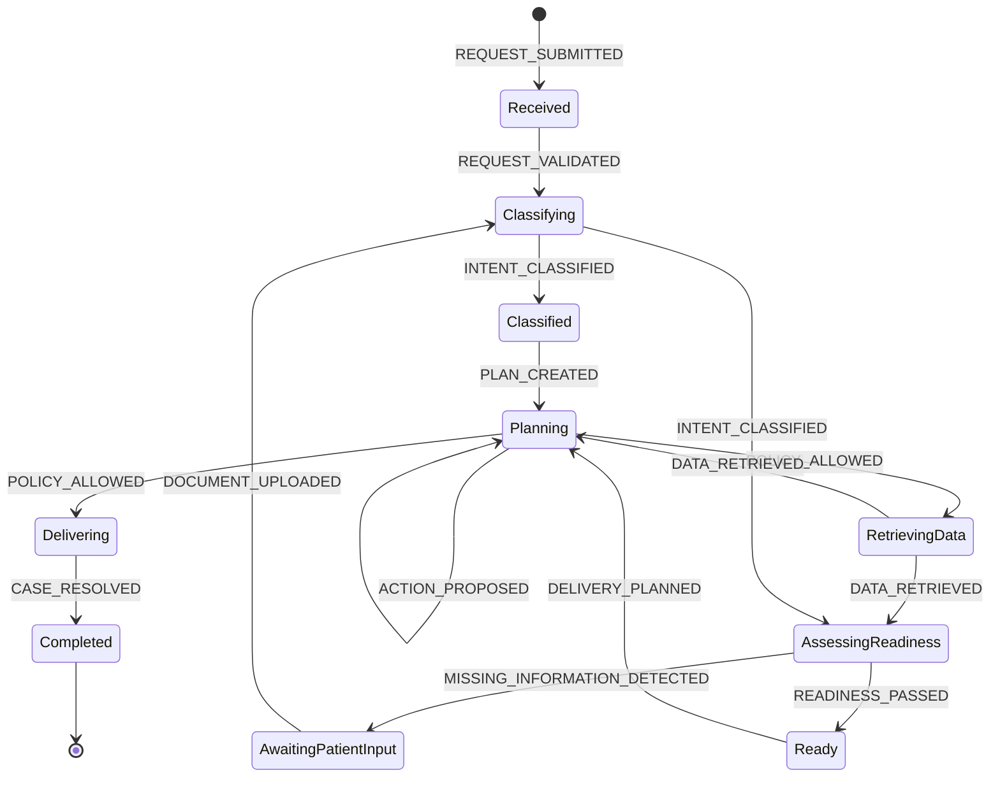
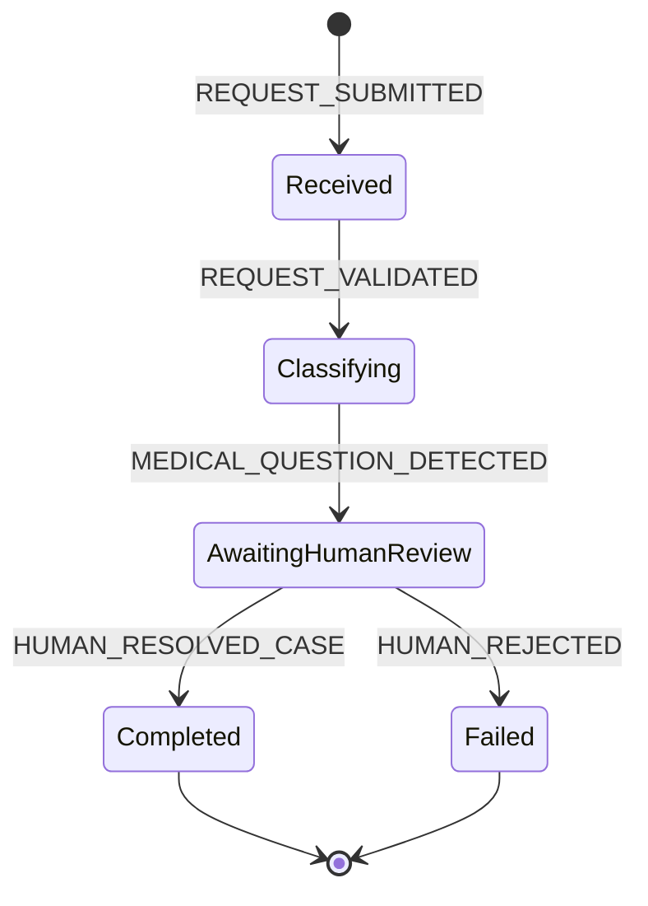
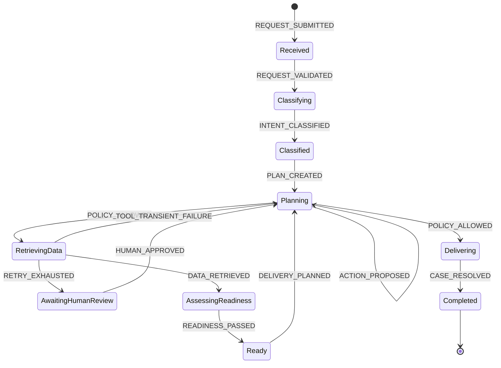

<!-- Generated by scripts/spec_to_md.py from Hospital_Agent_Clean.docx. Do not edit. -->

# 4. תרשימי שלושת התרחישים

**תרחיש 1 - מסלול תקין**

**תרחיש 2 - הסלמה רפואית**

**תרחיש 3 - כשל טכני**

התרשימים מציגים את מסלולי ה־State. רצף האירועים המפורט נמצא בסעיף 15; כל מעבר כפוף לטבלת סעיף 3.
